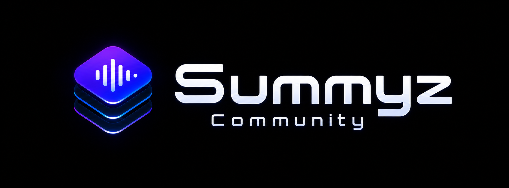

  

  <a href="./README.md">English</a> |
  <a href="./docs/pt-BR/README.md">Português</a>

  <b>Summyz Community</b> records voice calls on command, transcribes each participant's audio, and publishes
  summaries with decisions and tasks.

  
  
  
  
  

---

## How it works

Summyz records each participant separately. After recording ends, it transcribes the audio while
preserving speakers, timestamps, and overlapping speech, reviews the text without changing its
structure, and generates a summary with topics, decisions, tasks, and open issues. The result and
complete transcript are published in a Discord forum post.

Each stage selects its provider: OpenRouter for external execution, faster-whisper for local
transcription, and Ollama for local refinement and summary. A profile can combine local and external
execution. The dashboard brings together configuration, history, participation, costs, and tasks.

## Requirements

- Git and Docker with Compose;
- a Discord bot application and the Discord account that owns the servers to be configured;
- an OpenRouter account, credits, and API key only for stages using that provider;
- compatible drivers and Docker integration when GPU acceleration is used.

The Docker workflow prepares Node, Python, FFmpeg, PostgreSQL, Ollama, and faster-whisper. For native
development, see [Development and quality](./docs/development.md).

## Quick start

1. Prepare the Discord application using the [installation guide](./docs/installation.md).
2. From the repository root, run `./summyz-community up` on Linux/macOS or
   `.\summyz-community.ps1 up` on Windows. The launcher generates `.env` with local secrets, detects
   hardware, and opens setup. Enter the bot token; the Application ID is derived automatically.
3. Configure the application's Client Secret and OAuth redirect, connect the owner's Discord
   account, and install the bot in the server.
4. Complete an AI profile, install its local models when needed, and activate it for the server.
   Set the publication forum and recording authorizations.
5. Join a standard voice channel and run `/record`. Use `/stop` in the same channel to finish;
   recording ends automatically when everyone leaves.

Local mode keeps the dashboard on `127.0.0.1` and requires no password. For a public VPS, set
`PUBLIC_BASE_URL` to the HTTPS origin and use `./summyz-community-public up` or
`.\summyz-community-public.ps1 up`; setup requires one installation password and Caddy provides TLS.
The Discord connection identifies server ownership; it does not create Summyz user accounts.

Never commit `.env` or share tokens, the Client Secret, or the private setup URL.

## Next steps and documentation

- [Installation](./docs/installation.md): Discord preparation, local/public execution, and first recording.
- [Configuration](./docs/configuration.md): server access, profiles, models, languages, and parameters.
- [Operations](./docs/operations.md): administration, recovery, publication, retention, costs, and backups.
- [Development and quality](./docs/development.md): environment, tests, migrations, and CI.
- [Bot command reference](./docs/reference/bot-commands.md): syntax and access rules.
- [Release checklist](./docs/release-checklist.md) and [security policy](./SECURITY.md).

The English and [pt-BR](./docs/pt-BR/README.md) versions are maintained together.

## Contributing

Individual contributions are welcome. Corporate contributions are not currently
accepted.

1. Fork the repo and create a feature branch.
2. Keep modules small and single-purpose; follow the existing structure.
3. Add tests for new logic — `npm test` must pass.
4. Read and accept the Individual CLA and create the public acceptance record.
5. Open a pull request describing the change and the reasoning.

See [CONTRIBUTING.md](./CONTRIBUTING.md) and
[CLA-INDIVIDUAL.md](./docs/legal/CLA-INDIVIDUAL.md). For bugs and feature requests, please open an
issue.

## License

Summyz Community is source-available software under the
[Summyz Community License 1.0](./LICENSE.md). It permits personal use, free internal
business use, free external availability under its conditions, and paid administration
of customer-controlled infrastructure within the stated exception. It does not permit
selling the bot, charging for its services or configuration, or offering monetized
hosted access.

This is not an Open Source Initiative-approved open-source license. The names and Brand
Assets are governed by the [trademark policy](./TRADEMARKS.md), and Third-Party
Materials retain their own terms. See [NOTICE.md](./NOTICE.md) and
[THIRD_PARTY_NOTICES.md](./THIRD_PARTY_NOTICES.md).
